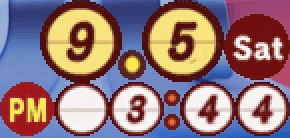

# Animal Crossing Clock for KDE Plasma

The 2005 *Animal Crossing Desktop Clock* from Nintendo, ported to Linux as a KDE Plasma 6 widget.

The clock shows the month and day, day of the week, and time on rolling digits, all recreated and scaled from the original artwork cleanly. Every change of the minute, hour, or date plays the same flip animation as the original, and the default town tune from *Animal Crossing* plays at the top of every hour.

## Requirements

- KDE Plasma 6
- The Qt 6 Multimedia QML module, for the sounds (Arch `qt6-multimedia`, Fedora `qt6-qtmultimedia`, Debian and Ubuntu `qml6-module-qtmultimedia`, openSUSE `qt6-multimedia-imports`)

## Installing

Download the `.plasmoid` file from the latest release, then in Plasma open *Add Widgets → Get New Widgets → Install Widget From Local File* and select it. The widget can be placed on the desktop or on a panel.

Right-click to access the settings in order to change the time format, scale, chime, whether the colon blinks, and quiet hours.

## About the Network Evaluation page

In the summer of 2005, Nintendo of America distributed this desktop widget to My Nintendo members as an incentive for participating in a ten-minute connectivity test for the Nintendo Wi-Fi Connection, prior to the service's official launch. The clock's *Network Evaluation* command asked a few questions about your router, pinged Nintendo's server, and sent the results to their servers. That service is long gone, so the page in this widget connects to nothing and sends nothing. It is kept for historical preservation and fun, and includes all the original artwork and buttons.

## History

The clock first shipped in January 2002 as *Doubutsu no Mori+ Desktop Clock* on the bonus CD-ROM of Shogakukan's *Nintendo Kōshiki Guidebook: Doubutsu no Mori+*. Nintendo of America localized it as *Animal Crossing Desktop Clock* in August 2005 for the Wi-Fi Connection test described above. The Japanese original had two settings, the hourly tune and always-on-top, which became the "Alarm" and "Display on top" items in the US version's menu.

## Licensing

The widget's code is released under the GNU General Public License, version 3 or later; see `LICENSE`. The artwork and sounds are © 2005 Nintendo, taken from the long-discontinued freeware clock, and are included here for personal use. They are not covered by the GPL and remain Nintendo's property.

*Animal Crossing* and *Doubutsu no Mori* are trademarks of Nintendo. This project is not affiliated with or endorsed by Nintendo.
